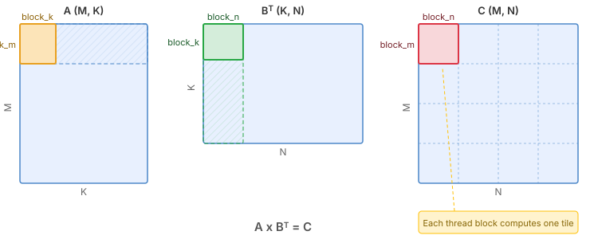
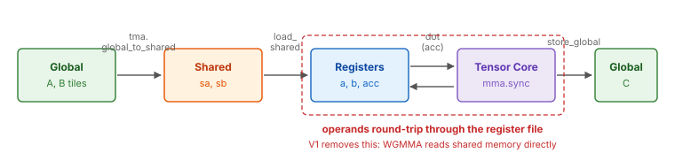

.. _tutorial_hopper_matmul_v0:

0. A Minimal Hopper Matmul
==========================

This first version implements a minimal but correct matrix multiplication kernel
on Hopper GPUs. It introduces two key Hopper features:
**TMA** (Tensor Memory Access, :doc:`tma </python-api/instruction-groups/tma>`)
for bulk data movement, and **asynchronous barriers**
(:doc:`mbarrier </python-api/instruction-groups/mbarrier>`) for tracking when that
movement completes.

The tensor cores are still driven the Ampere way --- operands are staged into
registers and multiplied with the classic ``mma.sync`` instruction. That is the
piece we replace in V1. The kernel is not yet fast, but it establishes the
foundation for everything that follows.

The Full Kernel
---------------

Before diving into the details, here is the complete kernel so you can see the
big picture. We will explain each part in the sections that follow.

.. hint::
   :class: margin

   To view the generated CUDA source code, check the cache directory.
   See :doc:`/programming-guides/cache` for details.

.. literalinclude:: ../../../../examples/hopper_matmul/matmul_v0.py
   :language: python
   :start-at: @tilus.autotune
   :end-at: self.store_global(gc, casted_acc, offsets=[offset_m, offset_n])
   :caption: MatmulTMA --- full kernel

Block Tiling
------------

We compute :math:`C = A \times B^T` where A is (M, K) and B is (N, K).
The output matrix C is (M, N).

Each thread block is responsible for computing one ``block_m x block_n`` tile of
C. The K dimension is iterated in chunks of ``block_k``.

   Block tiling of the matmul. Each thread block computes one output tile.
   The hatched regions show the full slices of A and B\ :sup:`T` that participate
   in computing the highlighted C tile.

.. note::

   **Data layout: K-major.** Hopper tensor cores expect operands in shared memory
   with K contiguous (or MN-contiguous). This tutorial uses K-major throughout, so
   A is ``[M, K]`` and B is ``[N, K]``. The MMA expects logical shapes ``[M, K]``
   and ``[K, N]``, which is why we call ``b.transpose()`` --- a view operation
   that reinterprets the layout without moving data.

Data Flow
---------

Triton also uses Hopper hardware features like TMA and WGMMA, but manages them
automatically through compiler passes. Tilus opens the black box: you control
memory placement, data movement, and synchronization directly, which is necessary
for achieving peak performance. The kernel moves data through three memory levels:

   Data flow in the kernel: Global Memory |rarr| Shared Memory |rarr| Registers |rarr| Global Memory.

.. |rarr| unicode:: U+2192

1. **Global** |rarr| **Shared**:
   :meth:`tma.global_to_shared() <tilus.lang.instructions.tma.TmaInstructionGroup.global_to_shared>`
   loads tiles of A and B from global memory into shared memory asynchronously,
   using the dedicated TMA hardware engine.
2. **Shared** |rarr| **Register**: :meth:`~tilus.Script.load_shared` reads the
   staged tiles into per-thread registers, laid out to match what the tensor core
   MMA instruction expects.
3. **Register** |rarr| **Register**: :meth:`~tilus.Script.dot` multiplies the two
   register tiles and accumulates into an fp32 register accumulator. This lowers
   to the classic ``mma.sync`` tensor core instruction.
4. **Register** |rarr| **Global**: :meth:`~tilus.Script.store_global` writes the
   final result back to global memory.

Note that steps 2 and 3 are where Hopper leaves performance behind: every operand
element makes a round trip through the register file before reaching the tensor
core. V1 removes that round trip entirely.

TMA: Tensor Memory Access
-------------------------

TMA is a hardware unit introduced on Hopper that asynchronously copies a
multi-dimensional tile between global and shared memory. Compared to the
Ampere-era ``cp.async`` path (where every thread issues its own 16-byte copy):

- **Fewer instructions**: one TMA call replaces hundreds of per-thread copy
  instructions.
- **No thread occupation**: the TMA engine operates independently; the issuing
  thread can proceed to other work.
- **Built-in address generation**: TMA handles multi-dimensional indexing and
  shared-memory swizzling internally, so no registers are burned on address
  math.

In Tilus, TMA loads are issued via
:meth:`tma.global_to_shared() <tilus.lang.instructions.tma.TmaInstructionGroup.global_to_shared>`.
The instruction takes a global tensor ``src``, a shared tensor ``dst``,
``offsets`` into the global tensor, and an ``mbarrier`` for completion tracking.
The tile shape and swizzle pattern are derived from the shared tensor, and Tilus
builds the required tensor map descriptor for you.

For more details, see :doc:`/python-api/instruction-groups/tma`.

Asynchronous Barriers (mbarrier)
--------------------------------

In Triton, synchronization is handled implicitly. On Hopper, many operations are
**asynchronous**: the instruction returns immediately and the work completes in
the background. This enables overlapping data movement with computation, but
requires explicit tracking of when operations finish. This is the role of the
**mbarrier** (memory barrier, see :doc:`/python-api/instruction-groups/mbarrier`).

.. figure:: /python-api/instruction-groups/figures/mbarrier_state.svg
   :width: 88%
   :align: center

   An mbarrier tracks pending arrivals and a phase bit.

An mbarrier is a **64-bit synchronization object in shared memory** that tracks:

- **Pending arrivals**: how many threads still need to signal they are done.
  Each :meth:`mbarrier.arrive() <tilus.lang.instructions.mbarrier.BarrierInstructionGroup.arrive>`
  call decrements this count.
- **Pending transactions** (tx-count): how many bytes of asynchronous transfer
  are still outstanding.
- **Phase** (1 bit): flips between 0 and 1 each time a phase completes.

A phase completes when both pending arrivals and tx-count reach zero. At that
point, the hardware automatically flips the phase bit and resets the counters
for the next phase.

**Wait** checks the phase:
:meth:`mbarrier.wait(barrier, phase=p) <tilus.lang.instructions.mbarrier.BarrierInstructionGroup.wait>`
blocks until the barrier's current phase differs from ``p``. When the phase has
flipped, the tracked operations are guaranteed to have completed.

**Why flip the phase?** The same barrier is reused across loop iterations. The
phase bit distinguishes "this iteration completed" from "the previous iteration
completed." After each wait, the caller flips its local phase variable
(``phase ^= 1``) so the next wait targets the new phase:

.. code-block:: python

   phase: uint32 = 0               # start expecting phase 0
   for ...:
       ...                          # issue async work on the barrier
       self.mbarrier.wait(barrier, phase=phase)  # wait for current phase
       phase ^= 1                  # next iteration waits for the other phase

Tracking TMA Completion with tx-count
--------------------------------------

TMA loads are tracked through the mbarrier's **tx-count** (transaction byte
count) rather than through arrivals. The flow is:

1. A single thread calls
   :meth:`mbarrier.arrive_and_expect_tx() <tilus.lang.instructions.mbarrier.BarrierInstructionGroup.arrive_and_expect_tx>`
   to declare how many bytes the upcoming TMA transfers will deliver. This both
   arrives at the barrier (decrementing pending arrivals) and increases the
   barrier's tx-count.
2. :meth:`tma.global_to_shared() <tilus.lang.instructions.tma.TmaInstructionGroup.global_to_shared>`
   is issued. When the TMA engine completes a transfer, the hardware
   automatically decrements the barrier's tx-count by the number of bytes
   delivered.
3. :meth:`mbarrier.wait() <tilus.lang.instructions.mbarrier.BarrierInstructionGroup.wait>`
   blocks until both pending arrivals **and** tx-count reach zero --- meaning the
   declaration has been made and all TMA data has landed in shared memory.

.. note::

   The ``transaction_bytes`` must exactly match the total bytes that will be
   transferred by the subsequent TMA calls. In our case, that is
   ``sa.nbytes + sb.nbytes``, the combined size of the two shared tiles
   (see :attr:`SharedTensor.nbytes <tilus.ir.SharedTensor.nbytes>`).

Thread Groups
-------------

By default, every instruction in a Tilus kernel operates on the **entire thread
block**: the ``__call__`` body defines the behavior of all threads in the block
collectively. However, efficient matrix multiplication kernels on Hopper require
different warps to perform different jobs and collaborate with each other
asynchronously. To narrow the execution scope to a subset of threads, Tilus
provides :doc:`thread groups </programming-guides/thread-group>`.

A thread group selects a subset of threads within the block using
:meth:`~tilus.Script.thread_group`. For example:

.. code-block:: python

    with self.thread_group(thread_begin=0, num_threads=32):
        # Only threads 0-31 (one warp) execute this
        ...

    with self.thread_group(thread_begin=32, num_threads=32):
        # Only threads 32-63 execute this
        ...

Tilus also provides shortcuts for common patterns:
:meth:`~tilus.Script.single_thread` for one thread,
:meth:`~tilus.Script.single_warp` for one warp (32 threads), and
:meth:`~tilus.Script.warp_group` for a full warp group (4 warps).

Note that Tilus does not expose ``threadIdx`` to the user. There is no way to
write ``if threadIdx.x < 32`` in a Tilus program. Instead, use
:meth:`~tilus.Script.thread_group` and its shortcuts to narrow the execution
scope.

Every Tilus instruction has a requirement on the thread group it can execute in.
Some instructions work in any thread group, while others require a single thread,
a single warp, or a warp group. V0 uses only the simplest case:
:meth:`~tilus.Script.single_thread`, so that ``arrive_and_expect_tx`` counts one
arrival and one byte declaration instead of 128 of each:

.. literalinclude:: ../../../../examples/hopper_matmul/matmul_v0.py
   :language: python
   :start-at: with self.single_thread():
   :end-at: self.mbarrier.wait(tma_barrier, phase=phase)
   :dedent: 12

For more details, see :doc:`/programming-guides/thread-group`.

Walkthrough
-----------

With the key Hopper features covered above (TMA, asynchronous barriers, and
thread groups), let us now walk through the kernel code in detail.

A Tilus kernel is defined as a subclass of :class:`~tilus.Script`. The
``__init__`` method stores compile-time hyperparameters (tile sizes), and
``__call__`` describes the kernel logic. For more on the script structure, see
:doc:`/programming-guides/tilus-script`.

The ``@tilus.autotune`` decorators define a search space for compile-time
hyperparameters. Tilus benchmarks all combinations and picks the fastest
configuration automatically. For more on autotuning, see
:doc:`/programming-guides/autotuning`.

Kernel Setup
~~~~~~~~~~~~

.. literalinclude:: ../../../../examples/hopper_matmul/matmul_v0.py
   :language: python
   :start-at: self.attrs.blocks = [
   :end-at: phase: uint32 = 0
   :dedent: 8
   :caption: Kernel setup

- :attr:`self.attrs.blocks <tilus.lang.script.Attributes.blocks>` sets the grid
  dimensions: ``ceil(M / block_m) x ceil(N / block_n)`` thread blocks.
- :attr:`self.attrs.warps <tilus.lang.script.Attributes.warps>` sets the number
  of warps per block. Here we use 4 warps (128 threads) --- one warp group, the
  granularity the Hopper tensor core will require from V1 onward.
- ``offset_m`` and ``offset_n`` are the output tile offsets, computed from the
  block index (:attr:`~tilus.Script.blockIdx`).
- :meth:`~tilus.Script.global_view` interprets the raw pointers as 2D global
  memory tensors with the given dtype and shape.
- :meth:`~tilus.Script.shared_tensor` allocates shared memory tiles for staging
  A and B data.
- :meth:`~tilus.Script.register_tensor` allocates the fp32 accumulator,
  distributed across the 128 threads of the block. A ``128 x 256`` fp32
  accumulator costs 256 registers per thread --- a real constraint on Hopper,
  since the accumulator lives in the same register file as everything else.
- :meth:`mbarrier.alloc() <tilus.lang.instructions.mbarrier.BarrierInstructionGroup.alloc>`
  allocates one mbarrier with an expected arrival count of 1, because exactly one
  thread will call ``arrive_and_expect_tx`` on it each iteration.

Main Loop
~~~~~~~~~

.. literalinclude:: ../../../../examples/hopper_matmul/matmul_v0.py
   :language: python
   :start-at: for offset_k in range(0, k_size, block_k):
   :end-at: phase ^= 1
   :dedent: 8
   :caption: Main loop

In each iteration:

- :meth:`~tilus.Script.single_thread` narrows the scope so that
  :meth:`mbarrier.arrive_and_expect_tx() <tilus.lang.instructions.mbarrier.BarrierInstructionGroup.arrive_and_expect_tx>`
  declares the expected bytes exactly once. The two
  :meth:`tma.global_to_shared() <tilus.lang.instructions.tma.TmaInstructionGroup.global_to_shared>`
  calls then load the A and B tiles for this K-chunk, and
  :meth:`mbarrier.wait() <tilus.lang.instructions.mbarrier.BarrierInstructionGroup.wait>`
  blocks until both have landed.
- :meth:`~tilus.Script.sync` after the ``single_thread`` block is what makes the
  data visible to the *other* 127 threads: only thread 0 executed the wait, so
  the remaining threads need a block-wide barrier before they may read shared
  memory. This lowers to ``__syncthreads()``.
- :meth:`~tilus.Script.load_shared` reads the two shared tiles into register
  tensors, and :meth:`~tilus.Script.dot` accumulates
  ``acc += a @ b.transpose()`` on the tensor cores.
- The second :meth:`~tilus.Script.sync` guards the *other* direction: the next
  iteration's TMA will overwrite ``sa`` and ``sb``, so every thread must be done
  reading them before thread 0 is allowed to issue the next load.
- ``phase ^= 1`` flips the local phase so the next ``mbarrier.wait`` targets
  the new phase of the reused barrier.

Note how much of the loop is *waiting*. The TMA runs, then everyone waits; the
MMA runs, then everyone waits again. Nothing overlaps. That is the theme of the
next several versions.

Epilogue
~~~~~~~~

.. literalinclude:: ../../../../examples/hopper_matmul/matmul_v0.py
   :language: python
   :start-at: casted_acc = self.cast(acc, dtype=float16)
   :end-at: self.store_global(gc, casted_acc, offsets=[offset_m, offset_n])
   :dedent: 8
   :caption: Epilogue

After the loop, :meth:`~tilus.Script.cast` converts the fp32 accumulator to fp16
and :meth:`~tilus.Script.store_global` writes the result to global memory
directly from registers.

.. note::

   You might expect a :meth:`~tilus.Script.free_shared` on ``sa`` and ``sb``
   here, and the kernel deliberately does not have one. Nothing is allocated
   after this point, so freeing would reclaim no shared memory --- but it would
   return those slots to the allocator's free list. Barriers are placed *after*
   the whole function has been emitted, at which point the allocator sees only
   that static free list and not the fact that the TMA engine writes ``sa`` and
   ``sb`` throughout the loop above. Placing an mbarrier inside a live TMA
   destination corrupts the barrier's state, and the failure is a subtle one:
   the kernel still runs, still produces mostly-correct output, and drops NaNs
   into a fraction of a percent of the result on some launches and not others.

Running the Kernel
------------------

``MatmulTMA()`` creates a kernel template. Compilation happens on the first call.

Note the two different integer annotations in the function signature:

- ``int32`` (e.g., ``m_size: int32``): a **runtime** parameter. The value is
  passed to the GPU kernel as an argument and can change between calls without
  recompilation.
- ``int`` (e.g., ``n_size: int``, ``k_size: int``): a **compile-time
  constant**. The value is baked into the generated CUDA code, so a new value
  triggers JIT recompilation and autotuning.

Making ``n_size`` and ``k_size`` compile-time constants allows the compiler to
specialize the kernel (e.g., unroll loops, compute constant addresses). For more
details, see :doc:`/programming-guides/tilus-script`.

Once compiled, subsequent calls with the same compile-time values dispatch
directly to the GPU.

.. literalinclude:: ../../../../examples/hopper_matmul/matmul_v0.py
   :language: python
   :start-at: def main
   :end-at: print(df)
   :caption: Launch, verify, and benchmark

Performance
-----------

This minimal kernel reaches **305 TFLOPS** (3.60 ms), about 41% of cuBLAS. The
autotuner settles on a small ``64 x 128`` tile with ``block_k=64``. Only 5 of the
15 candidates in the search space compile at all: a ``128 x 256`` fp32
accumulator needs 256 registers per thread on its own, past the 255-register
limit, and the operand fragments ``mma.sync`` requires have to fit alongside it.
Nsight Compute reports only 59% tensor pipe utilization --- the tensor cores
spend most of their time waiting on the shared-to-register traffic feeding them.
The complete source is at :github:`examples/hopper_matmul/matmul_v0.py`.

.. plot:: tutorials/matmul-hopper/plots/plot_v0.py

   Hopper matmul performance on H100 SXM (M=N=K=8192, fp16). Latency is
   CUDA-event timed, median of three fresh processes. Peak is the published
   dense FP16 tensor core throughput of the H100 SXM.

What's Next
-----------

This kernel works but is far from optimal. The main bottleneck is the
**MMA path**: :meth:`~tilus.Script.dot` lowers to ``mma.sync``, which requires
every operand fragment to be loaded from shared memory into registers first.
That costs instructions, register file bandwidth, and registers --- all of which
compete with the accumulator that already dominates the register budget.

In :doc:`the next version <v1>`, we replace it with **WGMMA** (warp-group MMA),
Hopper's asynchronous tensor core instruction. WGMMA reads its operands
**directly from shared memory** via a descriptor, so the ``load_shared`` step
disappears completely, and a single instruction issued by one warp group covers a
much larger tile.
