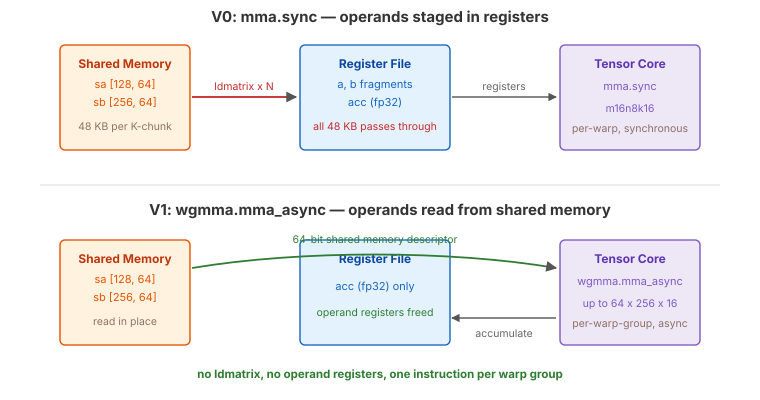

.. _tutorial_hopper_matmul_v1:

1. WGMMA: Hopper's Asynchronous Tensor Core
============================================

V0 drove the tensor cores through :meth:`~tilus.Script.dot`, which lowers to the
Ampere-era ``mma.sync`` instruction. Every operand fragment had to be copied from
shared memory into registers first, by explicit ``load_shared`` calls, before the
tensor core could see it.

This version replaces that with **WGMMA** (Warp Group Matrix Multiply-Accumulate,
:doc:`wgmma </python-api/instruction-groups/wgmma>`), Hopper's native tensor core
instruction. WGMMA is **asynchronous** and reads its ``A`` and ``B`` operands
**directly from shared memory** through a descriptor, so the register round trip
disappears entirely. A single WGMMA instruction, issued cooperatively by a warp
group (4 warps, 128 threads), covers a tile up to ``64 x 256 x 16``.

The change is small in code --- three lines swapped for four --- but it is the
single most important instruction on Hopper, and every later version builds on
its asynchronous protocol.

The Full Kernel
---------------

.. literalinclude:: ../../../../examples/hopper_matmul/matmul_v1.py
   :language: python
   :start-at: @tilus.autotune
   :end-at: self.store_global(gc, casted_acc, offsets=[offset_m, offset_n])
   :caption: MatmulWGMMA --- full kernel

What Changed from V0
--------------------

The kernel structure is unchanged --- same block tiling, same TMA loads, same
single-stage loop. Only the compute step differs.

.. list-table::
   :header-rows: 1
   :widths: 15 40 40

   * -
     - V0
     - V1
   * - **MMA instruction**
     - :meth:`~tilus.Script.dot` (``mma.sync``, synchronous)
     - :meth:`wgmma.mma() <tilus.lang.instructions.wgmma.WgmmaInstructionGroup.mma>` (``wgmma.mma_async``, asynchronous)
   * - **Operand source**
     - Registers (staged via :meth:`~tilus.Script.load_shared`)
     - Shared memory, read directly by the tensor core
   * - **Accumulator**
     - fp32 registers
     - fp32 registers (unchanged)
   * - **Issuing scope**
     - All threads
     - One warp group (4 warps), collectively
   * - **Completion**
     - Implicit (instruction retires in order)
     - ``commit_group`` + ``wait_group``
   * - **New instructions**
     -
     - :meth:`~tilus.lang.instructions.wgmma.WgmmaInstructionGroup.fence`,
       :meth:`~tilus.lang.instructions.wgmma.WgmmaInstructionGroup.mma`,
       :meth:`~tilus.lang.instructions.wgmma.WgmmaInstructionGroup.commit_group`,
       :meth:`~tilus.lang.instructions.wgmma.WgmmaInstructionGroup.wait_group`

Why Operands from Shared Memory Matter
--------------------------------------

   ``mma.sync`` (V0) stages both operands through the register file. WGMMA (V1)
   hands the tensor core a shared-memory descriptor instead, and only the
   accumulator stays in registers.

Consider a ``128 x 256 x 64`` block tile in fp16. With ``mma.sync``, the A and B
data for one K-chunk is ``(128 + 256) x 64 x 2 = 48 KB``, and all of it must pass
through the register file on its way to the tensor core --- every iteration, for
every block. That traffic costs three things:

- **Instructions**: hundreds of ``ldmatrix``/``LDS`` operations per K-chunk, all
  issued by the same warps that are supposed to be feeding the tensor core.
- **Register file bandwidth**: shared with the accumulator writes the tensor core
  is already performing.
- **Registers**: operand fragments need somewhere to live, and on Hopper the fp32
  accumulator alone can occupy 256 registers per thread.

WGMMA removes all three at once. The instruction takes a **descriptor** --- a
64-bit value encoding the shared memory base address, the leading/stride byte
offsets, and the swizzle mode --- and the tensor core walks shared memory itself.
In Tilus you never construct the descriptor by hand; passing a
:class:`~tilus.ir.tensor.SharedTensor` to
:meth:`wgmma.mma() <tilus.lang.instructions.wgmma.WgmmaInstructionGroup.mma>` is
enough, and the compiler derives the encoding from the tensor's layout.

.. note::

   WGMMA can also take its ``A`` operand from registers (``B`` must always come
   from shared memory). That variant is useful when A is produced on the fly, but
   for matmul the shared-memory form is what you want.

The WGMMA Protocol
------------------

WGMMA is asynchronous: :meth:`wgmma.mma() <tilus.lang.instructions.wgmma.WgmmaInstructionGroup.mma>`
returns immediately and the tensor core keeps working in the background. It also
reads shared memory and writes registers *outside* the normal instruction
ordering, so the hardware needs to be told where the boundaries are. Hopper
defines a strict four-step protocol:

.. code-block:: python

   self.wgmma.fence()          # 1. prior writes to operands/accumulator are visible
   self.wgmma.mma(sa, sb.transpose(), acc)   # 2. issue (may be called many times)
   self.wgmma.commit_group()   # 3. bundle all issued MMAs into one commit group
   self.wgmma.wait_group(0)    # 4. wait until at most 0 groups remain pending

1. :meth:`wgmma.fence() <tilus.lang.instructions.wgmma.WgmmaInstructionGroup.fence>`
   establishes ordering between generic memory accesses and the asynchronous
   tensor core. It guarantees that the shared memory written by TMA, and the
   accumulator registers written by any previous non-WGMMA instruction, are
   visible to the MMA about to be issued.
2. :meth:`wgmma.mma() <tilus.lang.instructions.wgmma.WgmmaInstructionGroup.mma>`
   computes ``d = a @ b + d``. A ``[block_m, block_k]`` by ``[block_k, block_n]``
   product is decomposed by the compiler into the hardware's native
   ``64 x N x 16`` shapes and issued as a sequence of instructions.
3. :meth:`wgmma.commit_group() <tilus.lang.instructions.wgmma.WgmmaInstructionGroup.commit_group>`
   closes a *commit group* over every MMA issued since the last commit. Groups
   complete in order.
4. :meth:`wgmma.wait_group(n) <tilus.lang.instructions.wgmma.WgmmaInstructionGroup.wait_group>`
   blocks until at most ``n`` commit groups are still pending. ``wait_group(0)``
   waits for everything.

V1 uses ``wait_group(0)`` immediately after committing, which throws away the
asynchrony --- the warp group issues one MMA and stands still until it finishes.
That is deliberate: it keeps V1 a one-line change in behavior from V0. Keeping
groups in flight with ``wait_group(1)`` is what :doc:`V5 <v5>` does once there is
a pipeline deep enough to feed it.

.. note::

   All four instructions must be executed by a **full warp group** --- 4
   consecutive warps, 128 threads, starting at a warp-group-aligned index. In V1
   the whole block is one warp group (``warps = 4``), so the plain block scope
   satisfies this. From :doc:`V3 <v3>` onward, where the block contains warps
   with different jobs, WGMMA is issued inside an explicit
   :meth:`~tilus.Script.thread_group`.

Walkthrough
-----------

Setup and epilogue are identical to V0. Only the compute half of the main loop
changes.

Main Loop
~~~~~~~~~

.. literalinclude:: ../../../../examples/hopper_matmul/matmul_v1.py
   :language: python
   :start-at: for offset_k in range(0, k_size, block_k):
   :end-at: phase ^= 1
   :dedent: 8
   :caption: Main loop

**Load phase** (unchanged from V0): one thread declares the transaction bytes,
two :meth:`tma.global_to_shared() <tilus.lang.instructions.tma.TmaInstructionGroup.global_to_shared>`
calls fetch the A and B tiles, and the ``mbarrier.wait`` plus
:meth:`~tilus.Script.sync` make the data visible block-wide.

**Compute phase**: where V0 had ``load_shared`` twice followed by
:meth:`~tilus.Script.dot`, V1 has the four-step WGMMA sequence operating on
``sa`` and ``sb`` --- the shared tensors themselves. ``sb.transpose()`` is a view
that swaps the logical axes of the ``[block_n, block_k]`` tile into the
``[block_k, block_n]`` shape the MMA expects; no data is moved, and the transpose
is absorbed into the descriptor's stride encoding.

The trailing :meth:`~tilus.Script.sync` still guards the shared buffers against
the next iteration's TMA. Note that it is only correct because
``wait_group(0)`` has already retired the MMA --- with an in-flight WGMMA, a
plain ``__syncthreads()`` would say nothing about whether the tensor core is
still reading ``sa``.

Performance
-----------

Removing the register round trip is worth **1.8x**: 540 TFLOPS (2.04 ms), up from
V0's 305. Tensor pipe utilization rises from 59% to 67%. Freeing the operand
registers also lets the autotuner move up to a ``128 x 128`` tile with
``block_k=64``, twice V0's tile area, which is itself part of the gain.

Note what did *not* change: the kernel is still load-then-compute with nothing
overlapping, so it remains far from cuBLAS.
The complete source is at :github:`examples/hopper_matmul/matmul_v1.py`.

.. plot:: tutorials/matmul-hopper/plots/plot_v1.py

   Hopper matmul performance on H100 SXM (M=N=K=8192, fp16). Latency is
   CUDA-event timed, median of three fresh processes. Peak is the published
   dense FP16 tensor core throughput of the H100 SXM.

What's Next
-----------

V1 is still **single-stage**: the loop waits for TMA to complete before issuing
the MMA, then waits for the MMA before starting the next TMA. Load and compute
are fully serialized, so the TMA engine idles during compute and the tensor cores
idle during load. We now have the right instruction, driven in the wrong shape.

In :doc:`the next version <v2>`, we introduce **multi-stage software pipelining**
--- shared memory becomes a ring buffer with one barrier per stage, and the TMA
for iteration *i+1* is issued before waiting on iteration *i*, so loading and
computing finally overlap.
