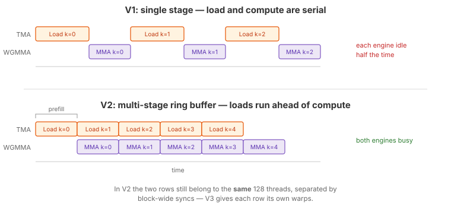

.. _tutorial_hopper_matmul_v2:

2. Multi-Stage Software Pipelining
===================================

In :doc:`V1 <v1>`, each loop iteration first waits for TMA to finish loading data,
then issues the WGMMA. Load and compute are fully serialized --- the TMA engine
sits idle during the MMA, and the tensor cores sit idle during the load. Both of
Hopper's asynchronous engines spend most of their time waiting for the other.

This version introduces **multi-stage software pipelining**: shared memory is
divided into multiple stages (a ring buffer), and the kernel prefills several
stages before entering the main loop. In each iteration of the main loop, the TMA
loads data for a future iteration while the tensor cores process data from a
previously loaded stage.

Pipelining is the right idea, and every later version keeps it. But V2 is also
the one version in this series that ends up *slower* than its predecessor, and
understanding why is more instructive than the speedup would have been: a ring
buffer indexed at runtime costs more than the overlap it buys, and the block-wide
``__syncthreads()`` around each stage puts a hard floor under how much overlap is
achievable at all. :doc:`V3 <v3>` fixes both.

If you have used Triton, this is similar to Triton's ``num_stages`` parameter ---
but here you control the pipelining explicitly: allocating per-stage buffers,
issuing prefill loads, and managing phase tracking yourself.

The Full Kernel
---------------

.. literalinclude:: ../../../../examples/hopper_matmul/matmul_v2.py
   :language: python
   :start-at: @tilus.autotune
   :end-at: self.store_global(gc, casted_acc, offsets=[offset_m, offset_n])
   :caption: MatmulWGMMAV2 --- full kernel

What Changed from V1
--------------------

.. list-table::
   :header-rows: 1
   :widths: 15 40 40

   * -
     - V1
     - V2
   * - **Shared memory**
     - Single stage: ``[block_m, block_k]``
     - Multi-stage ring buffer: ``[num_stages, block_m, block_k]``
   * - **TMA barriers**
     - 1 barrier
     - 1 barrier **per stage**
   * - **Phase tracking**
     - Single ``phase`` scalar
     - Per-stage ``phase`` register tensor
   * - **Loop structure**
     - Load then compute, serial
     - Prefill stages, then overlap load and compute
   * - **New parameter**
     - ---
     - ``num_stages`` (autotuned: 2, 3, or 4)

Software Pipelining
-------------------

   Top: V1 serializes load and compute. Bottom: V2 overlaps them using a
   multi-stage ring buffer.

The idea is simple: if we have ``S`` stages of shared memory, we can have up to
``S`` TMA loads in flight while one stage is being consumed by the tensor cores.
The kernel proceeds in two phases:

1. **Prefill** --- Before the main loop, issue TMA loads for the first ``S``
   K-tiles. These loads run asynchronously; the kernel does not wait for them.
2. **Main loop** --- Each iteration does three things:

   - **Wait**: block on the current stage's barrier until its TMA has landed.
   - **Compute**: run WGMMA on the current stage's data.
   - **Preload**: issue a TMA load for K-tile ``iter + S`` into the stage that
     was just consumed.

   The stage index advances modulo ``num_stages``, cycling through the ring
   buffer.

The crucial reordering compared to V1 is that the *preload* for a future tile is
issued while the tensor cores still have work queued behind them. By the time the
loop comes back around to that stage, its data has already arrived, and the wait
costs nothing.

Multi-Stage Shared Memory
-------------------------

In V1, shared tensors had shape ``[block_m, block_k]`` --- a single buffer that
was overwritten every iteration. In V2, shared tensors gain a leading stage
dimension:

.. code-block:: python

   sa = self.shared_tensor(dtype=float16, shape=[self.num_stages, block_m, block_k])
   sb = self.shared_tensor(dtype=float16, shape=[self.num_stages, block_n, block_k])

Each stage ``sa[i]`` / ``sb[i]`` is an independent buffer. TMA writes to one stage
while WGMMA reads from another, without conflicts. This is also why ``num_stages``
must be autotuned rather than simply maximized: the ring buffer is
``num_stages * (block_m + block_n) * block_k * 2`` bytes and has to fit in the
228 KB of shared memory an H100 SM can give a single block. Deeper pipelines
hide more latency, but force smaller tiles.

Per-Stage Barriers and Phase Tracking
-------------------------------------

Each stage has its own mbarrier so that its TMA completion is tracked
independently:

.. code-block:: python

   tma_barriers = self.mbarrier.alloc(counts=[1 for _ in range(self.num_stages)])
   phase = self.register_tensor(dtype=uint32, shape=[self.num_stages], init=0)

V2 keeps a **per-stage phase**, held in a small register tensor, and flips
``phase[stage]`` each time that stage is consumed. This is the most direct way to
express the ring buffer: each barrier alternates between "filled" and "consumed"
on its own schedule, and the phase array simply remembers where each one is.

.. hint::
   :class: margin

   :doc:`V3 <v3>` replaces this with a single per-role phase scalar that flips on
   wrap-around, which the compiler can keep in one register instead of
   ``num_stages`` of them.

Loop Unrolling and Stage Indices
--------------------------------

There is a subtlety with a ring buffer: ``stage = iter % self.num_stages`` is a
runtime value, so every ``sa[stage]`` access needs an address computation, and
the compiler cannot see which barrier a given wait refers to. If instead the loop
body is unrolled by ``num_stages``, each unrolled copy has a *constant* stage
index --- the modulo folds away, addresses become compile-time offsets, and the
barrier waits resolve to specific barriers.

V2 uses Python's ``range()`` and pays that cost. From :doc:`V3 <v3>` onward the
loops switch to :meth:`self.range() <tilus.Script.range>` with
``unroll=num_stages``:

.. code-block:: python

   for offset_k in self.range(0, k_size, block_k, unroll=self.num_stages):

Both are lowered to the same loop statement internally; ``self.range`` just
carries the extra unroll hint.

Walkthrough
-----------

Prefill
~~~~~~~

.. literalinclude:: ../../../../examples/hopper_matmul/matmul_v2.py
   :language: python
   :start-at: for stage in range(max_num_stages):
   :end-before: for iter in range(num_iters):
   :dedent: 8
   :caption: Prefill: load the first num_stages tiles

Before the main loop, one TMA load is issued per stage without waiting. Each
targets stage ``i`` and signals ``tma_barriers[i]``. ``max_num_stages`` guards
the case where the K loop is shorter than the pipeline depth --- with
``k_size / block_k < num_stages`` there is simply not enough work to fill every
stage, and issuing loads past the end of K would read out of bounds.

Main Loop
~~~~~~~~~

.. literalinclude:: ../../../../examples/hopper_matmul/matmul_v2.py
   :language: python
   :start-at: for iter in range(num_iters):
   :end-before: self.free_shared(sa)
   :dedent: 8
   :caption: Main loop: overlap preload and compute

In each iteration:

- **Wait** (on ``stage``):
  :meth:`mbarrier.wait() <tilus.lang.instructions.mbarrier.BarrierInstructionGroup.wait>`
  blocks until this stage's TMA data has arrived, using that stage's own phase.
  The following :meth:`~tilus.Script.sync` publishes the arrival to the whole
  block, since only one thread waited.

- **Compute** (from ``stage``): the WGMMA sequence from V1, reading
  ``sa[stage]`` and ``sb[stage]``. ``phase[stage] ^= 1`` prepares that stage's
  barrier for its next cycle.

- **Preload** (into ``preload_stage``): if K-tile ``iter + num_stages`` exists,
  issue its TMA into the stage that was just freed. The guard
  ``preload_iter < num_iters`` stops the pipeline from running past the end of K
  in the final iterations, letting it drain naturally.

The trailing :meth:`~tilus.Script.sync` closes the iteration: it must come
*after* the preload has been issued, so the loads for later stages are already in
flight when the next iteration begins.

.. note::

   Correctness here still leans on ``wgmma.wait_group(0)`` inside the loop. The
   tensor cores fully retire stage ``i``'s MMA before the code reaches the point
   where stage ``i`` is reused as a preload target, so a plain block-wide
   ``sync`` is enough to protect the buffer. Once :doc:`V5 <v5>` keeps a WGMMA
   group in flight across iterations, that reasoning breaks and an explicit
   producer-consumer handshake becomes mandatory.

Performance
-----------

V2 measures **506 TFLOPS** (2.17 ms) --- about 6% *slower* than V1's 540. The
autotuner picks a 2-stage pipeline on the same ``128 x 128`` tile with
``block_k=64`` that V1 chose, so this is a clean like-for-like comparison, and the
pipelining genuinely does not pay for itself here. Nsight Compute shows why the
result is close rather than catastrophic: tensor pipe utilization is essentially
unchanged (68% vs 67%), while DRAM throughput jumps from 24% to 65% --- the
overlap is working on the memory side, but it is not translating into tensor core
occupancy.

Three costs eat the gain:

- **Runtime stage indexing.** The loop is a plain ``range()``, so
  ``stage = iter % num_stages`` is a runtime value. Every ``sa[stage]`` access
  needs address arithmetic, and ``phase[stage]`` is a register tensor indexed by
  a runtime value --- which the compiler cannot keep in registers.
- **Two block-wide syncs per iteration.** These are unchanged from V1, and they
  serialize the very phases the ring buffer is trying to overlap.
- **Only two stages.** Deeper pipelines were available in the search space but
  lose to shallower ones, because at this tile size the extra shared memory does
  not buy proportionally more latency hiding.

The lesson is that a ring buffer alone does not create overlap --- it only creates
the *opportunity* for it. As long as all 128 threads must meet at a barrier
between loading and computing, the opportunity goes unused.
The complete source is at :github:`examples/hopper_matmul/matmul_v2.py`.

.. plot:: tutorials/matmul-hopper/plots/plot_v2.py

   Hopper matmul performance on H100 SXM (M=N=K=8192, fp16). TFLOPS derived
   from NCU profiling. Peak TFLOPS estimated from cuBLAS tensor core
   utilization.

What's Next
-----------

V2 overlaps TMA loads with WGMMA compute across iterations, but there is still a
structural limitation: **every thread does every job**. The same 128 threads
issue the TMA, wait on the barrier, run the MMA, and wait for it --- separated by
``__syncthreads()`` calls that force the whole block into lockstep at each
transition. The tensor cores cannot run ahead, because the warps that would issue
the next MMA are parked in a block-wide barrier.

In :doc:`the next version <v3>`, we split the block by role: a dedicated
**producer warp** that does nothing but issue TMA loads, and a **consumer warp
group** that does nothing but run WGMMA. They communicate through a pair of
producer/consumer barriers instead of ``__syncthreads()``, so each can run at its
own pace.
