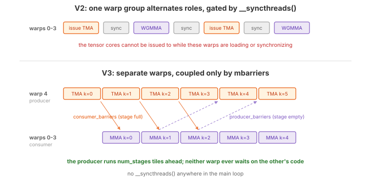

.. _tutorial_hopper_matmul_v3:

3. Warp Specialization
======================

:doc:`V2 <v2>` overlaps TMA and WGMMA across iterations, but every warp in the
block does every job. The same 128 threads issue the TMA, wait on its barrier,
run the MMA, and wait for it --- with a ``__syncthreads()`` at each transition
that forces the whole block into lockstep. The tensor cores cannot run ahead of
the loader, because the warps that would issue the next MMA are sitting in a
block-wide barrier.

This version introduces **warp specialization**: warps are given *different jobs*
and run *different code*. One warp becomes a dedicated **producer** that does
nothing but issue TMA loads; the remaining four warps become a **consumer** warp
group that does nothing but run WGMMA. They never meet at a ``__syncthreads()``;
instead they hand stages back and forth through a pair of mbarriers.

Triton also performs warp specialization internally, but as a compiler pass with
no user-level control. In Tilus you explicitly assign roles to warps and define
how they communicate.

The Full Kernel
---------------

.. literalinclude:: ../../../../examples/hopper_matmul/matmul_v3.py
   :language: python
   :start-at: @tilus.autotune
   :end-at: self.store_global(gc, casted_acc, offsets=[offset_m, offset_n])
   :caption: MatmulWGMMAV3 --- full kernel

What Changed from V2
--------------------

.. list-table::
   :header-rows: 1
   :widths: 15 40 40

   * -
     - V2
     - V3
   * - **Warp structure**
     - 4 warps, all doing everything
     - 5 warps: 1 TMA producer + 4-warp consumer group
   * - **Barriers**
     - TMA barrier per stage
     - ``consumer_barriers`` + ``producer_barriers`` per stage
   * - **Synchronization**
     - ``__syncthreads()`` twice per iteration
     - None in the loop --- only mbarrier handshakes
   * - **Phase tracking**
     - Per-stage phase array
     - Per-role phase array, one per participant
   * - **Prefill**
     - Explicit prefill loop
     - Implicit: the producer runs ahead on its own
   * - **Loops**
     - ``range()``
     - :meth:`self.range() <tilus.Script.range>` with ``unroll=num_stages``
   * - **New instructions**
     -
     - :meth:`~tilus.Script.thread_group`,
       :meth:`~tilus.lang.instructions.mbarrier.BarrierInstructionGroup.arrive`

Why a Separate Producer Warp
----------------------------

   V2 alternates roles inside one warp group, gated by ``__syncthreads()``.
   V3 gives the TMA its own warp, so the producer can run several K-tiles ahead
   of the consumer.

A TMA load is issued by a *single thread* --- the rest of the warp contributes
nothing to it. In V2 that thread is part of the same warp group that runs WGMMA,
so issuing the next load means the warp group is not issuing MMA, and the
block-wide sync means no other warp can cover for it.

Splitting the roles fixes both problems:

- **TMA warp** (threads 128--159): loops over K-tiles issuing loads back-to-back.
  Before filling a stage, it waits only on ``producer_barriers[stage]`` to
  confirm the consumer is finished with that slot.
- **Consumer warp group** (threads 0--127): loops over K-tiles issuing WGMMA
  back-to-back. Before each MMA it waits only on ``consumer_barriers[stage]`` to
  confirm the data has landed.

Neither ever waits for the other's *code* --- only for a specific stage's data
dependency. The producer naturally runs ``num_stages`` tiles ahead, so the
consumer's wait is usually already satisfied when it arrives.

.. note::

   ``warps = 5`` is not a typo, and the ordering matters. The consumer group
   occupies warps 0--3 because WGMMA requires a **warp-group-aligned** span of
   four consecutive warps; warp 4 is left over for the producer. Putting the
   producer first would push the consumer to warps 1--4, which is not a valid
   warp group.

Producer-Consumer Barriers
--------------------------

V2 used one barrier per stage to signal "TMA has landed". That is only half the
handshake --- it says when a stage becomes *full*, but nothing about when it
becomes *empty* again, which V2 got for free from ``__syncthreads()``. Without
the block-wide sync, both directions must be explicit:

.. code-block:: python

   consumer_barriers = self.mbarrier.alloc(counts=[1 for _ in range(self.num_stages)])
   producer_barriers = self.mbarrier.alloc(counts=[128 for _ in range(self.num_stages)])

- ``consumer_barriers[i]``: signaled by the TMA engine's tx-count when stage
  ``i`` has been filled. The consumer waits on these. Arrival count is **1**,
  since a single thread declares the transaction bytes.
- ``producer_barriers[i]``: signaled when the consumer has finished reading stage
  ``i``. The producer waits on these. Arrival count is **128**, because every
  thread of the consumer warp group executes
  :meth:`mbarrier.arrive() <tilus.lang.instructions.mbarrier.BarrierInstructionGroup.arrive>`
  after ``wgmma.wait_group(0)``.

The **initial phases** are what make the pipeline start correctly:

- ``producer_phases`` starts at **1**. All mbarriers begin at hardware phase 0, so
  a wait expecting phase 1 does not match and passes immediately. That is exactly
  right: every stage starts empty, and the producer should begin filling without
  blocking.
- ``consumer_phases`` starts at **0**, which *does* match, so the consumer blocks
  until the producer's first load actually completes.

.. hint::
   :class: margin

   Tilus exposes these two values as
   ``self.mbarrier.producer_initial_phase`` and
   ``self.mbarrier.consumer_initial_phase``, which :doc:`V4 <v4>` uses instead of
   hard-coded literals.

Draining the Pipeline
---------------------

The producer's main loop exits after issuing the last K-tile, but at that moment
up to ``num_stages`` loads are still in flight and the consumer is still working
through them. If the producer warp simply exits, its threads leave the block
while the consumer is still arriving on ``producer_barriers`` --- so V3 adds a
drain loop that consumes the outstanding empty-signals without issuing anything:

.. literalinclude:: ../../../../examples/hopper_matmul/matmul_v3.py
   :language: python
   :start-at: for _ in self.range(min(self.num_stages, cdiv(k_size, self.block_k))):
   :end-at: stage = (stage + 1) % self.num_stages
   :dedent: 12
   :caption: Producer drain loop

The ``min(...)`` handles the short-K case for the same reason as V2's
``max_num_stages``: when there are fewer K-tiles than stages, fewer stages were
ever filled, so fewer signals will arrive.

Walkthrough
-----------

TMA Warp (Producer)
~~~~~~~~~~~~~~~~~~~

.. literalinclude:: ../../../../examples/hopper_matmul/matmul_v3.py
   :language: python
   :start-at: with self.thread_group(thread_begin=128, num_threads=32):
   :end-before: with self.thread_group(thread_begin=0, num_threads=128):
   :dedent: 8
   :caption: TMA warp

Each iteration:

- :meth:`mbarrier.wait() <tilus.lang.instructions.mbarrier.BarrierInstructionGroup.wait>`
  on ``producer_barriers[stage]`` blocks until the consumer has released this
  stage, then the local phase for that stage flips.
- Inside :meth:`~tilus.Script.single_thread`,
  :meth:`mbarrier.arrive_and_expect_tx() <tilus.lang.instructions.mbarrier.BarrierInstructionGroup.arrive_and_expect_tx>`
  declares the bytes for both tiles on ``consumer_barriers[stage]``.
- Two :meth:`tma.global_to_shared() <tilus.lang.instructions.tma.TmaInstructionGroup.global_to_shared>`
  calls load A and B into ``sa[stage]`` / ``sb[stage]``. In V3 these sit inside
  the same ``single_thread`` block as the declaration --- the simplest thing that
  works. :doc:`V4 <v4>` moves them out to warp scope, which is the form the later
  versions use.
- The stage index advances modulo ``num_stages``.

Note there is no explicit prefill loop as in V2. The producer simply starts
running, and because ``producer_phases`` starts at 1, its first
``num_stages`` waits all pass immediately.

Consumer Warp Group
~~~~~~~~~~~~~~~~~~~

.. literalinclude:: ../../../../examples/hopper_matmul/matmul_v3.py
   :language: python
   :start-at: with self.thread_group(thread_begin=0, num_threads=128):
   :end-at: self.store_global(gc, casted_acc, offsets=[offset_m, offset_n])
   :dedent: 8
   :caption: Consumer warp group

The consumer runs the matching loop:

- :meth:`mbarrier.wait() <tilus.lang.instructions.mbarrier.BarrierInstructionGroup.wait>`
  on ``consumer_barriers[stage]`` blocks until the TMA data has arrived.
- The WGMMA sequence computes on ``sa[stage]`` and ``sb[stage]``.
- :meth:`mbarrier.arrive() <tilus.lang.instructions.mbarrier.BarrierInstructionGroup.arrive>`
  on ``producer_barriers[stage]`` releases the stage. It comes *after*
  ``wgmma.wait_group(0)``, which is what makes the release safe: the tensor cores
  have finished reading shared memory, so the producer may overwrite it.
- The epilogue runs entirely within the consumer group, which is convenient ---
  the accumulator lives in these 128 threads' registers, so no data movement is
  needed to reach the ``store_global``.

Performance
-----------

Warp specialization lifts the kernel to **575 TFLOPS** (1.91 ms), 11% ahead of V2
and 6% ahead of V1. The autotuner chooses the *same* configuration as V2 --- 2
stages, ``128 x 128``, ``block_k=64`` --- so the entire gain comes from the
restructuring: removing the block-wide syncs, unrolling the ring buffer so stage
indices become constants, and letting the producer run ahead on its own warp.
Tensor pipe utilization rises to 75%, and DRAM throughput settles at 61%.

This is also where V2's investment finally pays off. Pipelining and warp
specialization are complementary: the ring buffer provides the slots, and warp
specialization provides the independent execution needed to fill them.
The complete source is at :github:`examples/hopper_matmul/matmul_v3.py`.

.. plot:: tutorials/matmul-hopper/plots/plot_v3.py

   Hopper matmul performance on H100 SXM (M=N=K=8192, fp16). Latency is
   CUDA-event timed, median of three fresh processes. Peak is the published
   dense FP16 tensor core throughput of the H100 SXM.

What's Next
-----------

V3 achieves true overlap between TMA and WGMMA. The remaining bottleneck is on
the compute side: there is exactly **one** consumer warp group, and it issues one
MMA and immediately waits for it. Between the ``wait_group(0)`` and the next
``mbarrier.wait``, the tensor core pipeline has nothing queued and drains.
Feeding it faster is not a matter of loading faster --- it needs *more
independent MMA work* available at any instant.

In :doc:`the next version <v4>`, we split the output tile across **two consumer
warp groups**, each owning half the rows of C, so two independent WGMMA streams
share the same loaded B tile. We also refactor the barrier bookkeeping into a
reusable ``Pipeline`` class, since the number of barriers, phases, and stage
counters is about to grow.
