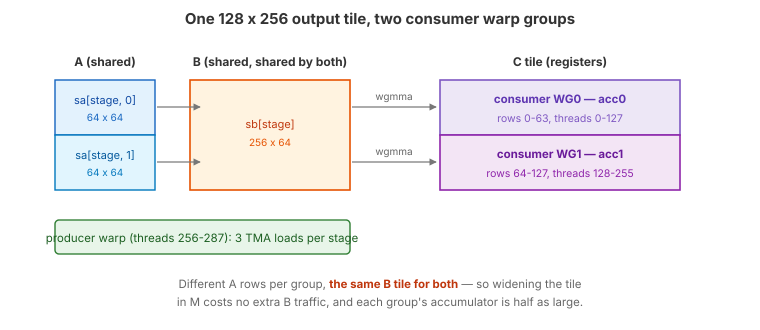
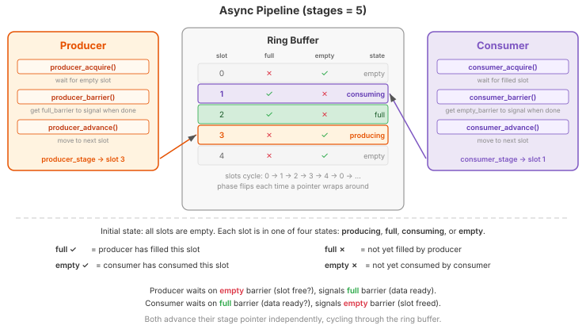
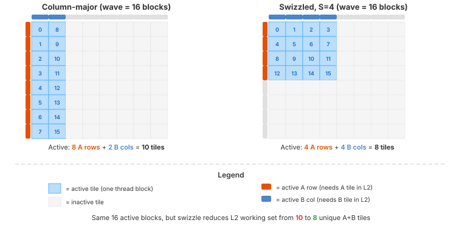

.. _tutorial_hopper_matmul_v4:

4. Pipeline Abstraction and Two Consumer Warp Groups
=====================================================

:doc:`V3 <v3>` decoupled loading from computing, but the compute side is still
narrow: **one** consumer warp group issues one WGMMA and immediately waits for
it. Between ``wgmma.wait_group(0)`` and the next ``mbarrier.wait``, the tensor
core pipeline has nothing queued and drains. More bandwidth will not help --- the
kernel needs more *independent MMA work* available at any instant.

This version adds two things:

1. **Two consumer warp groups** --- the output tile is split by rows, and each
   warp group computes its own half against the same shared B tile. Two
   independent WGMMA streams now feed the tensor cores.
2. **Pipeline abstraction** --- the barrier, phase, and stage bookkeeping from V3
   is encapsulated in a reusable ``Pipeline`` class built on ``tilus.Class``. With
   three participants instead of two, and more pipelines coming in later
   versions, the inline bookkeeping has outgrown its welcome.

The kernel also gains the **tile rasterization** machinery that :doc:`V5 <v5>`
turns on.

The Full Kernel
---------------

.. literalinclude:: ../../../../examples/hopper_matmul/matmul_v4.py
   :language: python
   :start-at: class Pipeline
   :end-at: offsets=[offset_m + block_m_half, offset_n],
   :caption: MatmulWGMMAV4 --- full kernel (including Pipeline class)

What Changed from V3
--------------------

.. list-table::
   :header-rows: 1
   :widths: 15 40 40

   * -
     - V3
     - V4
   * - **Warp structure**
     - 5 warps: 1 producer + 1 consumer group
     - 9 warps: 1 producer + **2** consumer groups
   * - **Output tile**
     - One ``block_m x block_n`` accumulator in one warp group
     - Split by rows: each group owns ``block_m/2 x block_n``
   * - **A in shared memory**
     - ``[stages, block_m, block_k]``
     - ``[stages, 2, block_m/2, block_k]`` --- one slab per consumer
   * - **B in shared memory**
     - ``[stages, block_n, block_k]``
     - Unchanged --- **shared by both** consumer groups
   * - **Barrier management**
     - Manual barriers, phases, and stage indices
     - ``Pipeline`` class (``tilus.Class``) encapsulates the bookkeeping
   * - **Empty-barrier arrivals**
     - 128 (every consumer thread)
     - 2 (one elected thread per consumer group)
   * - **Grid layout**
     - 2D grid
     - 1D grid with swizzled rasterization (bypassed when ``swizzle_size=1``)
   * - **New instructions**
     -
     - :meth:`~tilus.Script.fast_divmod`, ``tilus.Class``

Two Consumer Warp Groups
------------------------

   The ``block_m x block_n`` output tile is split by rows across two consumer
   warp groups. Each loads its own A slab; both read the same B tile.

A WGMMA instruction is issued by one warp group and its accumulator lives in that
group's registers. To get two MMAs in flight, we need two warp groups, and they
need separate accumulators --- so the natural split is by **rows of C**:

- Consumer WG0 (threads 0--127) computes rows ``[0, block_m/2)`` of the tile.
- Consumer WG1 (threads 128--255) computes rows ``[block_m/2, block_m)``.
- The producer warp (threads 256--287) feeds both.

The split has a pleasant property for memory traffic: the two halves need
**different rows of A** but the **same columns of B**. So A is stored as two
slabs, ``sa[stage, 0]`` and ``sa[stage, 1]``, one per consumer, while ``sb`` stays
a single tile that both groups read. Splitting the accumulator across two warp
groups also halves the per-thread register pressure of the accumulator, which is
what allows the tuned tile to grow from ``128 x 128`` (V3) to ``128 x 256``.

.. note::

   ``warps = 9`` again reflects warp-group alignment: consumers occupy warps
   0--3 and 4--7 (both warp-group aligned), leaving warp 8 for the producer.

Because two warp groups now share each stage, the empty-barrier arrival count
changes. In V3 all 128 consumer threads arrived; here each group elects a single
thread:

.. literalinclude:: ../../../../examples/hopper_matmul/matmul_v4.py
   :language: python
   :start-at: tma_pipe = Pipeline(num_stages, producer_arrive_count=1, consumer_arrive_count=2)
   :end-at: tma_pipe = Pipeline(num_stages, producer_arrive_count=1, consumer_arrive_count=2)
   :dedent: 8
   :caption: Two arrivals per stage, one per consumer group

``consumer_arrive_count=2`` means the producer may refill a stage only after
*both* consumer groups have released it. Electing one thread per group (rather
than letting all 256 arrive) turns 256 barrier updates per K-tile into 2.

Pipeline Abstraction
--------------------

On Hopper, mbarriers are the mechanism for tracking asynchronous work, and shared
memory is the buffer for data in transit. When producer and consumer run at
different speeds --- always, in practice --- a **pipeline** decouples them.

A pipeline has three components:

1. **Producer** --- generates data and writes it into a buffer slot when one is
   available.
2. **Consumer** --- reads data from a slot when one is filled.
3. **Ring buffer** --- a fixed number of slots (``num_stages``) that producer and
   consumer cycle through independently.

Each slot carries two mbarriers:

- **full barrier** --- signaled when the producer has filled the slot. Consumers
  wait on this.
- **empty barrier** --- signaled when the consumers have drained the slot. The
  producer waits on this.

Producer and consumer each keep a **stage pointer** and a **phase variable**, and
advance through the ring independently, synchronized only by barrier signals.

   A 5-stage pipeline. The producer is filling slot 3 while the consumers drain
   slot 1; slot 2 is full and waiting, slots 0 and 4 are empty. The check marks
   indicate whether each slot's full/empty mbarrier has completed.

V3 managed all of this inline. The ``Pipeline`` class below packages it behind a
small API. Note that this is not a built-in part of Tilus --- it is assembled
from ordinary instructions (``mbarrier.alloc``, ``mbarrier.wait``, ...) as a
user-level helper. Managing the barriers by hand, as in V3, remains perfectly
valid.

.. literalinclude:: ../../../../examples/hopper_matmul/matmul_v4.py
   :language: python
   :start-at: class Pipeline
   :end-before: # A deliberately shallow synchronous pipeline
   :caption: Pipeline class

``Pipeline`` inherits from ``tilus.Class``, which behaves like
:class:`~tilus.Script` but for helper objects that are not kernels themselves: it
can allocate barriers and shared tensors and use any Tilus instruction. Two
details are worth pointing out:

- The phases are initialized from ``self.mbarrier.producer_initial_phase`` and
  ``self.mbarrier.consumer_initial_phase`` rather than the literals ``1`` and
  ``0`` that V3 used.
- ``producer_advance`` / ``consumer_advance`` flip the phase **on wrap-around**
  (``phase ^= (stage == 0)``) rather than keeping a per-stage array as V2 did.
  One scalar per role replaces ``num_stages`` registers, and after the loop is
  unrolled by ``num_stages`` the compiler resolves each stage index to a
  constant.

The kernel-side usage reads cleanly:

.. code-block:: python

   tma_pipe.producer_acquire()                       # wait for an empty slot
   # ... issue TMA loads against tma_pipe.producer_barrier() ...
   tma_pipe.producer_advance()

   tma_pipe.consumer_acquire()                       # wait for a full slot
   # ... issue WGMMA on tma_pipe.consumer_stage ...
   self.mbarrier.arrive(tma_pipe.consumer_barrier())  # release the slot
   tma_pipe.consumer_advance()

Tile Rasterization
------------------

V4 also introduces the grid-remapping machinery that :doc:`V5 <v5>` relies on.
Each output tile (m, n) needs a row-strip of A and a column-strip of B. A rows
are unique per tile, but **B columns are shared by every tile in the same
N-column** --- so B traffic can be served from L2 if the tiles that share it run
at the same time.

The question is how to order tiles so that the set of A rows and B columns
touched by the concurrently running blocks --- the **L2 working set** --- stays
small.

   An 8 x 8 tile grid with a wave of 16 active blocks. Orange bars mark active
   A rows; blue bars mark active B columns. Swizzling yields a smaller working
   set (8 vs 10 strips) for the same number of active blocks.

With a plain 2D grid, ``blockIdx.x`` walks down M first, so a wave of 16 blocks
fills two full columns: 8 A rows plus 2 B columns = 10 strips resident. Grouping
the same 16 blocks into a 4 x 4 square touches 4 A rows plus 4 B columns = 8
strips --- 20% less L2 pressure. The mapping divides the N axis into groups of
``swizzle_size`` columns and assigns tiles within a group in row-major order:

.. literalinclude:: ../../../../examples/hopper_matmul/matmul_v4.py
   :language: python
   :start-at: def compute_block_coord
   :end-at: return m_block, n_block
   :dedent: 4
   :caption: Tile rasterization with swizzle grouping

When ``num_n_blocks`` is not divisible by ``swizzle_size``, the final group is
narrower; ``last_group_width`` handles that case so the mapping stays a bijection.

.. hint::

   Integer division and modulo are expensive on GPUs. For compile-time constant
   divisors (like ``swizzle_size``) the compiler emits a multiply and shift
   automatically. For **grid-constant** divisors --- the same for every block, but
   not known at compile time, like ``tiles_per_group`` ---
   :meth:`~tilus.Script.fast_divmod` precomputes a magic number once per launch
   and uses integer multiply-shift instead of the compiler's floating-point
   fallback.

V4's tuned configuration selects ``swizzle_size=1``, which the kernel treats as a
bypass: since ``swizzle_size`` is a compile-time autotune constant, the branch is
resolved while tracing and V4 launches a plain 2D grid with no remapping cost at
all. Rasterization only starts paying off in V5, where deeper pipelining makes
the kernel bandwidth-sensitive enough to care.

Walkthrough
-----------

Producer Warp
~~~~~~~~~~~~~

.. literalinclude:: ../../../../examples/hopper_matmul/matmul_v4.py
   :language: python
   :start-at: with self.thread_group(thread_begin=256, num_threads=32):  # TMA producer warp
   :end-before: with self.thread_group(thread_begin=0, num_threads=128):  # consumer WG0
   :dedent: 8
   :caption: TMA producer warp

The structure matches V3's producer, now expressed through the Pipeline API.
Three TMA loads are issued per stage instead of two: one per A slab, plus B. The
``arrive_and_expect_tx`` declares all three tiles' bytes at once, so a single
barrier tracks the whole stage.

Note the placement of :meth:`~tilus.Script.single_thread`: it wraps only the
``arrive_and_expect_tx``, not the TMA calls. The transaction-byte declaration
must happen exactly once, but the loads themselves are issued at warp
granularity.

Consumer Warp Groups
~~~~~~~~~~~~~~~~~~~~

.. literalinclude:: ../../../../examples/hopper_matmul/matmul_v4.py
   :language: python
   :start-at: with self.thread_group(thread_begin=0, num_threads=128):  # consumer WG0
   :end-before: with self.thread_group(thread_begin=128, num_threads=128):  # consumer WG1
   :dedent: 8
   :caption: Consumer warp group 0

Each consumer group runs the same loop against its own A slab (``consumer_idx``
0 or 1) and its own accumulator, then writes its half of C with
:meth:`~tilus.Script.store_global`. The two groups are otherwise identical, and
the second differs only in the slab index and the row offset of its store.

The MMA is still **synchronous** --- ``wait_group(0)`` after every commit --- so
each group finishes its MMA before releasing the stage. The parallelism gained
here comes from having *two* groups doing that at once, not from overlapping
within a group. Overlapping within a group is V5's job, and it needs a deeper
pipeline to be safe.

Performance
-----------

V4 reaches **572 TFLOPS** (1.92 ms), a modest 1.6% over V3. The headline number
undersells what changed: the two consumer groups let the tile grow from
``128 x 128`` to ``128 x 256``, and sharing one B tile between them cuts DRAM
throughput almost in half, from 61% to 35%. The kernel has stopped being memory
hungry --- but it has not yet converted that slack into tensor core work, because
each group still drains its MMA pipeline every K-tile.

.. note::

   V3 and V4 are close enough that measurement method matters. Under CUDA-event
   timing V4 wins consistently across fresh processes, but under Nsight Compute's
   replay-based profiling V3 measures faster (567 vs 521 TFLOPS). Replay
   serializes kernel execution and re-runs it many times with cold caches, which
   penalizes V4's shallow 2-stage pipeline more than V3's steadier one. The
   wall-clock timing is the one to trust for ranking; the NCU counters are still
   the right tool for *explaining* the difference, which is what the DRAM figures
   above do.

The complete source is at :github:`examples/hopper_matmul/matmul_v4.py`.

.. plot:: tutorials/matmul-hopper/plots/plot_v4.py

   Hopper matmul performance on H100 SXM (M=N=K=8192, fp16). Latency is
   CUDA-event timed, median of three fresh processes. Peak is the published
   dense FP16 tensor core throughput of the H100 SXM.

What's Next
-----------

V4 doubles the number of independent MMA streams, but each stream is still
strictly serial: issue, commit, **wait**, release, repeat. The tensor cores drain
between every K-tile of every group. Meanwhile the tuned pipeline is only two
stages deep, so there is little slack for the producer to run ahead.

In :doc:`the next version <v5>`, we deepen the pipeline to four stages and keep a
WGMMA group **in flight** across iterations with ``wait_group(1)`` --- issuing
K-tile *i+1*'s MMA before waiting on K-tile *i*'s. This finally removes the drain
between MMAs, and turns on the tile rasterization introduced here.
