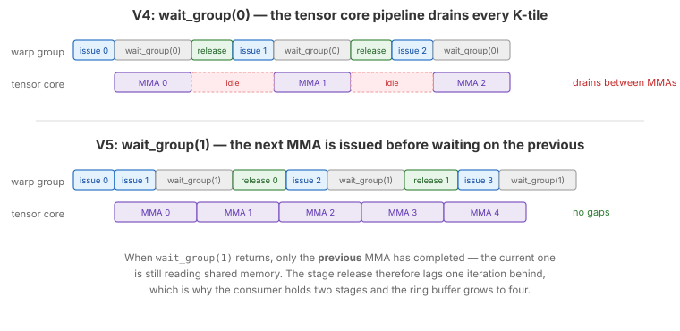

.. _tutorial_hopper_matmul_v5:

5. Overlapping WGMMA Groups
============================

:doc:`V4 <v4>` runs two consumer warp groups, but each one is strictly serial:
issue, commit, **wait**, release, repeat. Every K-tile, both groups stop at
``wgmma.wait_group(0)`` until the tensor cores are completely done. The tensor
core pipeline therefore drains once per K-tile per group, and the barrier
handshake that follows sits squarely on the critical path.

WGMMA is asynchronous precisely so this is avoidable. This version keeps **one
WGMMA group in flight at all times**: the consumer issues K-tile *i+1*'s MMA and
only then waits for K-tile *i* to finish, using ``wait_group(1)`` instead of
``wait_group(0)``. While the tensor cores work on tile *i+1*, the warp group is
free to release stage *i*, wait on the next barrier, and issue again.

Keeping an MMA in flight has a consequence: the shared memory it reads is still
live. The stage release must therefore lag one iteration behind, and the pipeline
must be deep enough to absorb that lag --- so V5 also grows from two stages to
four, and turns on the tile rasterization that :doc:`V4 <v4>` introduced.

The Full Kernel
---------------

.. literalinclude:: ../../../../examples/hopper_matmul/matmul_v5.py
   :language: python
   :start-at: class Pipeline
   :end-at: self.store_global(gc, casted1, offsets=[offset_m + block_m_half, offset_n])
   :caption: MatmulWGMMAV5 --- full kernel (including Pipeline class)

What Changed from V4
--------------------

.. list-table::
   :header-rows: 1
   :widths: 15 40 40

   * -
     - V4
     - V5
   * - **MMA completion**
     - ``wait_group(0)`` --- drain after every commit
     - ``wait_group(1)`` --- one group stays in flight
   * - **Loop shape**
     - Uniform loop over all K-tiles
     - Prologue MMA, steady-state loop, epilogue drain
   * - **Stage release**
     - Current stage, after the MMA completes
     - **Previous** stage, via ``prev_consumer_barrier()``
   * - **Pipeline depth**
     - 2 stages
     - 4 stages
   * - **Rasterization**
     - ``swizzle_size=1`` (bypassed, 2D grid)
     - ``swizzle_size=4`` (1D grid, swizzled)
   * - **New Pipeline method**
     -
     - ``prev_consumer_barrier()``

Keeping a WGMMA Group in Flight
-------------------------------

   ``wait_group(0)`` drains the tensor core pipeline every K-tile.
   ``wait_group(1)`` allows the next MMA to be issued first, so the tensor cores
   always have work queued.

Recall the WGMMA protocol: :meth:`wgmma.commit_group() <tilus.lang.instructions.wgmma.WgmmaInstructionGroup.commit_group>`
closes a group over the MMAs issued since the last commit, groups complete in
order, and :meth:`wgmma.wait_group(n) <tilus.lang.instructions.wgmma.WgmmaInstructionGroup.wait_group>`
blocks until at most ``n`` groups remain pending.

``wait_group(1)`` says: *"let one group still be running."* Restructuring the
loop around that gives:

.. code-block:: text

   prologue:   acquire stage 0, fence, mma(0), commit          # 1 group pending
   steady:     acquire stage i, fence, mma(i), commit          # 2 groups pending
               wait_group(1)                                   # mma(i-1) is done
               release stage i-1
   epilogue:   wait_group(0)                                   # mma(last) is done
               release last stage

The MMA for tile *i* is issued **before** the wait for tile *i-1*. From the
tensor cores' perspective there is no gap: the moment tile *i-1* retires, tile
*i* is already queued behind it.

The price is that the release must shift. When ``wait_group(1)`` returns, only
tile *i-1*'s MMA has certainly completed --- tile *i*'s is still reading
``sa[stage_i]`` and ``sb[stage_i]``. Releasing the *current* stage here would let
the producer overwrite shared memory that the tensor cores are actively reading.
So V5 adds ``prev_consumer_barrier()``:

.. literalinclude:: ../../../../examples/hopper_matmul/matmul_v5.py
   :language: python
   :start-at: def prev_consumer_barrier(self) -> RegisterTensor:
   :end-at: return self.empty_barriers[prev_stage]
   :dedent: 4
   :caption: Releasing the stage one behind the current one

Because the consumer now holds two stages at once (one being read by the tensor
cores, one just acquired), a 2-stage ring buffer would deadlock: the producer
could never find a free slot. Four stages give the producer room to run ahead
while two are pinned by the consumer.

.. note::

   This is the point where the informal reasoning of :doc:`V2 <v2>` --- "the MMA
   has retired, so a block-wide ``sync`` protects the buffer" --- stops being
   valid. With an MMA in flight, no ``__syncthreads()`` tells you anything about
   what the tensor cores are still reading. Only the WGMMA group counter does,
   which is why the empty-barrier arrival is placed immediately after
   ``wait_group(1)`` and refers to the previous stage.

Rasterization Turned On
-----------------------

V5 selects ``swizzle_size=4``, so the kernel takes the 1D-grid path introduced in
:doc:`V4 <v4>` and remaps ``blockIdx.x`` into swizzled ``(m_block, n_block)``
coordinates. Now that the pipeline keeps the tensor cores busy, the kernel is
sensitive to how quickly B tiles can be re-fetched, and grouping four N-columns
per raster group keeps those tiles resident in L2 across a wave of blocks.

The same mapping is used unchanged; only the tuned ``swizzle_size`` differs.

Walkthrough
-----------

Producer Warp
~~~~~~~~~~~~~

.. literalinclude:: ../../../../examples/hopper_matmul/matmul_v5.py
   :language: python
   :start-at: with self.thread_group(thread_begin=256, num_threads=32):  # TMA producer
   :end-before: with self.thread_group(thread_begin=0, num_threads=128):  # consumer WG0
   :dedent: 8
   :caption: TMA producer warp

Unchanged from V4 apart from the deeper ring buffer: acquire an empty stage,
declare the transaction bytes for both A slabs and B, issue three TMA loads,
advance. The drain loop at the end absorbs the trailing empty-signals so the warp
does not exit while consumers are still releasing stages.

Consumer Warp Group
~~~~~~~~~~~~~~~~~~~

.. literalinclude:: ../../../../examples/hopper_matmul/matmul_v5.py
   :language: python
   :start-at: with self.thread_group(thread_begin=0, num_threads=128):  # consumer WG0
   :end-before: with self.thread_group(thread_begin=128, num_threads=128):  # consumer WG1
   :dedent: 8
   :caption: Consumer warp group 0

The three-part structure is explicit in the code:

- **Prologue** --- acquire stage 0, fence, MMA, commit, advance. No wait: this
  first group is deliberately left in flight.
- **Steady state** --- the loop starts at ``block_k`` rather than 0, because tile
  0 was already issued. Each iteration acquires the next stage, issues and
  commits its MMA, then ``wait_group(1)`` retires the *previous* MMA, and one
  elected thread arrives on ``prev_consumer_barrier()``.
- **Epilogue** --- ``wait_group(0)`` retires the final MMA, its stage is released,
  and the accumulator is cast to fp16 and stored.

Consumer WG1 is identical except that it reads A slab 1 and stores to the lower
half of the output tile.

.. note::
   :class: margin

   ``with self.single_warp(): with self.single_thread():`` elects exactly one
   thread of the warp group to arrive, matching the pipeline's
   ``consumer_arrive_count=2``.

Performance
-----------

Overlapping the WGMMA groups is the largest single step in the series after V1:
**680 TFLOPS** (1.62 ms), 19% ahead of V4 and 91% of cuBLAS. Tensor pipe
utilization jumps from 68% to 88%, which is exactly the metric this change
targets --- the tensor cores now almost always have a queued group to start on the
cycle the previous one retires. DRAM throughput drops further to 29%, helped by
the 4-wide raster group keeping B tiles in L2.

The deeper 4-stage pipeline and the overlap are not separable: the overlap
requires the consumer to hold two stages at once, and the extra depth is what
keeps the producer from starving.
The complete source is at :github:`examples/hopper_matmul/matmul_v5.py`.

.. plot:: tutorials/matmul-hopper/plots/plot_v5.py

   Hopper matmul performance on H100 SXM (M=N=K=8192, fp16). Latency is
   CUDA-event timed, median of three fresh processes. Peak is the published
   dense FP16 tensor core throughput of the H100 SXM.

What's Next
-----------

V5 keeps the tensor cores fed within each of its two consumer groups, and Nsight
Compute confirms it: tensor pipe utilization reaches about 88%, up from roughly
68% in V4. The remaining headroom is in two places. First, the tile is still
``128 x 256``, so pipeline overhead is amortized over a relatively small amount of
compute. Second, the epilogue is a plain per-thread ``store_global`` from
registers, issued by both consumer groups at the same time at the very end.

In :doc:`the final version <v6>`, the tile grows to ``256 x 256`` split across
**four** consumer warp groups, the accumulator switches to native fp16 WGMMA
accumulation to fit the register budget, and the epilogue routes through a shared
memory buffer so results leave via a bulk TMA store.
