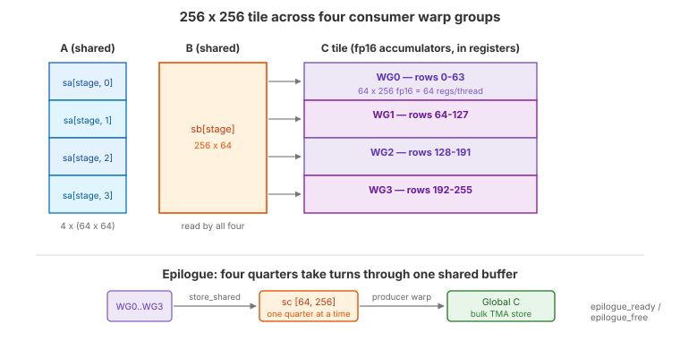

.. _tutorial_hopper_matmul_v6:

6. Four Consumers, FP16 Accumulation, and a TMA Epilogue
=========================================================

:doc:`V5 <v5>` keeps the tensor cores busy inside each consumer group, but two
costs remain fixed per output tile: the pipeline prologue and drain, and the
epilogue. With a ``128 x 256`` tile there is only so much compute to amortize
them over. The obvious response --- make the tile bigger --- runs into the
constraint that has shaped every version so far: **the accumulator lives in
registers**.

This version breaks that deadlock with three changes that only work together:

1. **Four consumer warp groups** on a ``256 x 256`` tile, so each group owns a
   ``64 x 256`` quarter and four independent WGMMA streams are in flight.
2. **Native fp16 WGMMA accumulation**, halving accumulator register cost so the
   larger tile fits at all.
3. **A shared-memory TMA epilogue**, where the four groups take turns staging
   their quarter through one shared buffer for a bulk TMA store.

Together with an 8-wide raster group, this is the version that passes cuBLAS.

The Full Kernel
---------------

.. literalinclude:: ../../../../examples/hopper_matmul/matmul_v6.py
   :language: python
   :start-at: class Pipeline
   :end-at: sa, sb, sc, tma_pipe, epilogue_ready, epilogue_free, 3, k_size
   :caption: MatmulWGMMAV6 --- full kernel (including Pipeline class)

What Changed from V5
--------------------

.. list-table::
   :header-rows: 1
   :widths: 15 40 40

   * -
     - V5
     - V6
   * - **Output tile**
     - 128 x 256
     - **256 x 256**
   * - **Consumer groups**
     - 2, each owning a 64 x 256 half
     - **4**, each owning a 64 x 256 quarter
   * - **Warps**
     - 9 (1 producer + 2 groups)
     - **17** (1 producer + 4 groups)
   * - **Accumulator dtype**
     - fp32 (cast to fp16 in the epilogue)
     - **fp16**, accumulated natively by WGMMA
   * - **Epilogue**
     - ``store_global`` from registers, per group
     - Serialized through one shared buffer, bulk TMA store
   * - **Epilogue issuer**
     - Each consumer group
     - The **producer warp**, after its loads are done
   * - **Rasterization**
     - ``swizzle_size=4``
     - ``swizzle_size=8``
   * - **Pipeline depth**
     - 4 stages
     - 3 stages (the larger tile costs more shared memory per stage)
   * - **New instructions**
     -
     - :meth:`~tilus.Script.store_shared`,
       :meth:`~tilus.lang.instructions.fence.FenceInstructionGroup.proxy_async`,
       :meth:`~tilus.lang.instructions.tma.TmaInstructionGroup.shared_to_global`,
       :meth:`~tilus.lang.instructions.tma.TmaInstructionGroup.commit_group`,
       :meth:`~tilus.lang.instructions.tma.TmaInstructionGroup.wait_group`

The Register Budget Problem
---------------------------

   A 256 x 256 output tile split by rows across four consumer warp groups. Each
   group loads its own A slab; all four read the same B tile.

A CUDA thread can hold at most 255 registers. An accumulator of ``m x n``
distributed over a 128-thread warp group costs ``m * n / 128`` registers per
thread in fp32. For V5's ``64 x 256`` per-group accumulator that is **128
registers** --- already half the budget, before operands, addresses, and loop
state.

Scaling to a ``256 x 256`` tile with four groups keeps each group's share at
``64 x 256``, so fp32 would still cost 128 registers per thread. Per-thread that
is legal, but there are now 512 consumer threads, and ``512 x 128 = 65536`` is
the entire register file of an SM --- with nothing left for operands, addresses,
loop state, or the producer warp. V6 instead accumulates in **fp16**:

.. literalinclude:: ../../../../examples/hopper_matmul/matmul_v6.py
   :language: python
   :start-at: acc = self.register_tensor(
   :end-at: )
   :dedent: 8
   :caption: fp16 accumulator

WGMMA supports fp16 accumulation natively for fp16 operands
(``wgmma.mma_async...f16.f16.f16``), so this is not a cast --- the tensor cores
accumulate in half precision throughout. Two fp16 values pack into one 32-bit
register, halving the accumulator to **64 registers per thread** and leaving room
for the larger tile and the epilogue.

.. warning::

   fp16 accumulation trades precision for capacity, and the trade is real. Over a
   K=8192 reduction with unit-variance outputs, the measured absolute error
   against cuBLAS has mean 0.0023, p99 0.0117, and a maximum of 0.047 --- which is
   why the benchmark checks V6 with ``atol=5e-2`` while earlier versions use
   ``1e-2``. Against an fp32 reference, V5 on the same inputs has mean error
   0.00014 and maximum 0.0020, so this is roughly an order of magnitude, not a
   rounding detail. It also means the headline comparison below is not
   like-for-like: cuBLAS is accumulating in fp32. For inference-style workloads
   the trade is typically fine; for training or ill-conditioned inputs, prefer
   the fp32 accumulation of :doc:`V5 <v5>`.

The B tile is shared by all four groups, so widening the tile in M costs no extra
B traffic --- the arithmetic intensity of the block improves, which is the whole
point.

Serialized Shared-Memory Epilogue
---------------------------------

With four groups each holding a ``64 x 256`` fp16 quarter, writing results out
becomes its own problem. Four simultaneous ``store_global`` calls from registers
produce many small, poorly coalesced transactions. Routing through TMA instead
requires the data to be in shared memory --- but a full ``256 x 256`` fp16
staging buffer would be 128 KB, competing with the pipeline's ring buffer for the
same 228 KB budget.

V6 allocates **one quarter-sized buffer** and has the groups take turns:

.. literalinclude:: ../../../../examples/hopper_matmul/matmul_v6.py
   :language: python
   :start-at: sc = self.shared_tensor(dtype=float16, shape=[block_m_slice, block_n])
   :end-at: epilogue_free = self.mbarrier.alloc([1, 1, 1])
   :dedent: 8
   :caption: Shared-memory and barrier allocation, including the epilogue handoff

Two barrier arrays sequence the handoff:

- ``epilogue_ready[i]`` --- consumer *i* has finished writing its quarter into
  ``sc``. Arrival count 128: every thread of the group participates in
  :meth:`~tilus.Script.store_shared`.
- ``epilogue_free[i]`` --- the buffer has been drained after consumer *i*, so
  consumer *i+1* may write. Arrival count 1, and there are only three of them:
  the last consumer needs no successor.

Each consumer therefore waits for its predecessor to clear the buffer before
writing, except consumer 0 which finds it free:

.. literalinclude:: ../../../../examples/hopper_matmul/matmul_v6.py
   :language: python
   :start-at: if consumer_idx > 0:
   :end-at: self.mbarrier.arrive(epilogue_ready[consumer_idx])
   :dedent: 8
   :caption: Consumer side of the epilogue handoff

The drain side runs on the **producer warp**, which by this point has finished
all its TMA loads and would otherwise be idle:

.. literalinclude:: ../../../../examples/hopper_matmul/matmul_v6.py
   :language: python
   :start-at: def store_epilogue
   :end-at: self.mbarrier.arrive(epilogue_free[consumer_idx])
   :dedent: 4
   :caption: Producer-side epilogue: shared memory to global via TMA

The sequence per quarter is: wait for the quarter to be staged, fence, issue the
bulk TMA store, wait for it, then release the buffer.

.. important::

   The :meth:`fence.proxy_async(space="shared") <tilus.lang.instructions.fence.FenceInstructionGroup.proxy_async>`
   is not optional. :meth:`~tilus.Script.store_shared` writes through the
   **generic proxy** (the ordinary load/store path), while
   :meth:`tma.shared_to_global() <tilus.lang.instructions.tma.TmaInstructionGroup.shared_to_global>`
   reads through the **async proxy** used by the TMA engine. Without a
   ``fence.proxy.async.shared::cta`` between them, the TMA engine may read stale
   data.

``tma.wait_group(n=0, read=True)`` waits only for the TMA engine to finish
**reading** shared memory --- enough to hand the buffer to the next consumer ---
rather than for the global writes to become visible, which nothing downstream
needs.

.. note::

   Global-to-shared TMA reports completion through **mbarrier tx-count**;
   shared-to-global TMA uses **commit_group + wait_group** instead. See
   `cp.async.bulk <https://docs.nvidia.com/cuda/parallel-thread-execution/#data-movement-and-conversion-instructions-cp-async-bulk>`__
   in the PTX documentation.

Note also the ordering of the four TMA loads in the producer's main loop: slabs
0, 2, 3, then 1. Slab 1's load is issued last so that consumer 1 --- the first
group that has to *wait* for the shared buffer --- is the least likely to be
blocked on its input as well.

Walkthrough
-----------

Producer Warp
~~~~~~~~~~~~~

.. literalinclude:: ../../../../examples/hopper_matmul/matmul_v6.py
   :language: python
   :start-at: with self.thread_group(thread_begin=512, num_threads=32):
   :end-before: with self.thread_group(thread_begin=0, num_threads=128):
   :dedent: 8
   :caption: Producer warp: K-loop, drain, then the epilogue

The producer has three phases. It fills the pipeline over the K loop with five
TMA loads per stage (four A slabs plus B), drains the outstanding empty-signals,
and then serves all four epilogue quarters in order.

Consumer Warp Groups
~~~~~~~~~~~~~~~~~~~~

.. literalinclude:: ../../../../examples/hopper_matmul/matmul_v6.py
   :language: python
   :start-at: def consume_tile
   :end-at: self.mbarrier.arrive(epilogue_ready[consumer_idx])
   :dedent: 4
   :caption: consume_tile --- shared by all four consumer groups

All four groups run the same ``consume_tile`` method, parameterized by
``consumer_idx``. The K-loop is V5's overlapped structure verbatim --- prologue
MMA, steady-state loop with ``wait_group(1)`` and a lagging stage release, final
``wait_group(0)`` --- followed by the epilogue handoff. The four call sites differ
only in their thread range and index:

.. literalinclude:: ../../../../examples/hopper_matmul/matmul_v6.py
   :language: python
   :start-at: with self.thread_group(thread_begin=0, num_threads=128):
   :end-at: sa, sb, sc, tma_pipe, epilogue_ready, epilogue_free, 3, k_size
   :dedent: 8
   :caption: Four consumer warp groups

``consumer_arrive_count=4`` on the pipeline reflects that all four groups must
release a stage before the producer may refill it.

Performance
-----------

V6 reaches **800 TFLOPS** (1.37 ms) against cuBLAS at 742 TFLOPS (1.48 ms), and is
18% ahead of V5. Nsight Compute puts tensor pipe utilization at 93.2%, essentially
level with cuBLAS's 93.8%, and DRAM throughput at 20%, the lowest of any version:
the ``256 x 256`` tile with a shared B tile has made the kernel almost entirely
compute bound.

Comparing against the cuBLAS timing taken in the same process, V6 wins every run,
by a **median of 7.8%**:

.. list-table::
   :header-rows: 1
   :widths: 12 20 20 24

   * - Run
     - V6
     - cuBLAS
     - V6 faster by
   * - 1
     - 1.3886 ms
     - 1.5014 ms
     - 8.1%
   * - 2
     - 1.3742 ms
     - 1.4630 ms
     - 6.5%
   * - 3
     - 1.3742 ms
     - 1.4809 ms
     - 7.8%

Quote the range, not a single run. Both kernels vary by 1--2% run to run, so the
ratio moves with whichever samples you happen to draw.

.. warning::

   The margin is also sensitive to how long the timed window is, because an
   8192\ :sup:`3` fp16 GEMM saturates the board's power budget. At the 30 timed
   iterations this tutorial uses, V6 leads by 6--8%; at 100 iterations the H100
   throttles partway through the window and the same three measurements read
   99%, 99%, and 110% of cuBLAS. The benchmark script takes a 3-second cooldown
   before every measurement, cuBLAS included, and exposes ``--repeat`` so this
   can be checked directly. Run it on an idle GPU.

The advantage survives the change of measurement method: under Nsight Compute's
replay profiling V6 comes in at 1.53 ms against cuBLAS's 1.56 ms --- still ahead,
but by 2% rather than 8%. Replay pins the SM clock near 1.41 GHz against a
1.98 GHz maximum, and at reduced clock the memory system is comparatively
over-provisioned, which is where most of V6's wall-clock advantage comes from.
The complete source is at :github:`examples/hopper_matmul/matmul_v6.py`.

.. plot:: tutorials/matmul-hopper/plots/plot_v6.py

   Hopper matmul performance on H100 SXM (M=N=K=8192, fp16). Latency is
   CUDA-event timed, median of three fresh processes. Peak is the published
   dense FP16 tensor core throughput of the H100 SXM.

Summary
-------

Starting from a minimal TMA-fed kernel that pushed every operand through the
register file (V0), we replaced the MMA path with Hopper's asynchronous
shared-memory WGMMA (V1), overlapped loading and computing with a multi-stage
ring buffer (V2), separated the two into dedicated producer and consumer warps
(V3), doubled the independent MMA streams and factored the bookkeeping into a
``Pipeline`` class (V4), kept a WGMMA group permanently in flight (V5), and
finally widened the tile to ``256 x 256`` across four consumer groups with fp16
accumulation and a bulk TMA epilogue (V6).

Two themes run through the whole series. The first is that Hopper's engines ---
TMA, the tensor cores, and the SM's own instruction issue --- are independent, and
performance comes from arranging for all of them to have work queued at all
times. The second is that the register file is the binding constraint on how
large a tile a Hopper kernel can hold, which is why the final step needed both
more warp groups and a narrower accumulator.

.. caution::

   The result reported here is specific to this shape (M=N=K=8192), dtype
   (fp16), accumulation precision (fp16, where cuBLAS uses fp32), GPU (H100 SXM),
   and benchmark methodology. It is not a claim that this kernel beats cuBLAS
   across GEMM shapes; the autotune spaces checked into the examples are pinned
   to a single configuration each, tuned for exactly this workload.
